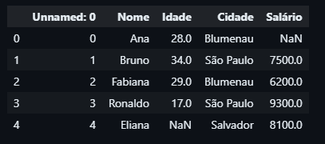

<h2 align="center" style="color: #00ff00;">Introdução ao Pandas</h2>

Como vimos antes, no Pandas temos Series e DataFrames, a primeira uma estrutura unidimensional e a segunda bidimensional. 

> *Exemplo - Series

Criação de uma Series no Pandas com valores inteiros e um nome

```python
s = pd.Series([10, 20, 30, 40, 50], name="Valores")
```

> *Exemplo - DataFrame*

Para DataFrames podemos cria-lós a partir da estrutura de dados dicionário, em queas chaves são as nossas colunas, e os valores presentes em cada chave são o conjunto de linhas.

-  Criando o Dicionário

```python
dados = {
    "Nome": ["Ana", "Bruno", "Fabiana", "Ronaldo", "Eliana", "Matias"],
    "Idade": [28, 34, 17, None, 78],
    "Cidade": ["Blumenau", "São Paulo", "Blumenau", "São Paulo", "Salvador", "São Paulo"],
    "Salário": [None, 7500, 6200, 9300, 8100, 15400],
}
```

Para fazer a conversão do dicionário para a tabela basta passar o dicionário como parâmetro no construtor.

```python
df = pd.DataFrame(dados)
```


<h2 align="center" style="color: #00ff00;">Leitura e Escrita de Dados no Formato CSV</h2>

Algumas vezes possa ser necessário salvar o arquivo do Dataframe ou da Series como um CSV ou outro tipo de arquivo, isso é basicamente escrever o arquivo CSV com as informações da nossa estrutura de dados. O Pandas fornece funções que fazem esse processo.

> *Exemplo - Salvando em CSV*

```python
df.to_csv("Dados.csv", index=False, encoding="utf-8")
```

-  O Index False é usado para evitar que o índice do DataFrame seja salvo como uma coluna no CSV.
-  O Encoding informa a codificação do arquivo.

Da mesma forma que escrevemos um CSV, podemos fazer a leitura desse arquivo com funções do Pandas.

> *Exemplo - Lendo o CSV*

O código abaixo além de ler o arquivo "Dados.csv", também exibe as cinco primeiras linhas do DataFrame.

```python
read_csv = pd.read_csv("Dados.csv")
read_csv.head()
```

Nesse caso, ele vai exibir a tabela comum e atribuir os índices automaticamente e de forma zero indexada, pois no dataframe "Dados.csv" ele foi salvo com index sendo False. Entretanto, se Index fosse True haveria uma tabela extra mostrando os índices, ou seja, teríamos duas colunas para os índices.

<div align="center"></div>

Para resolver esse problema, podemos remover a coluna repetida utilizando o método "drop()".

> *Exemplo - Deletando a coluna 0*

```python
df_read_csv.drop(df_read_csv.columns[0], axis=1)
```

-  axis = 0: refere-se a linha
-  axis = 1: refere-se a coluna